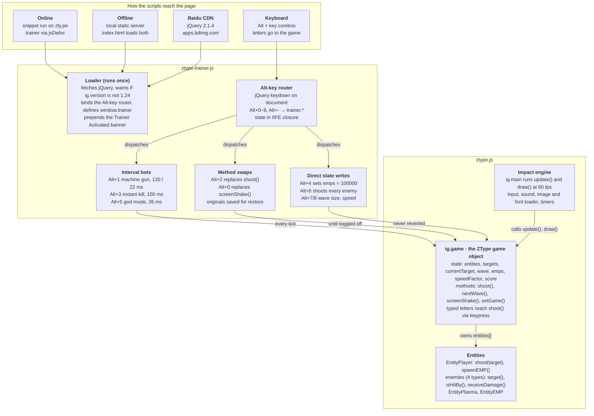

# ztype-trainer — Architecture Analysis

Oct 9, 2026 · Copy of the Claude Doc: https://claude.ai/artifact/4p5wZA23nrmSLuqt9RpDBT

## Overview

ztype-trainer is an 11.7 KB cheat script for ZType 1.24, a canvas typing-shooter by Phoboslab built on the Impact.js engine. It adds 11 Alt-key shortcuts (auto-fire, instant kill, god mode, unlimited EMP, wave spawning and more) by monkey-patching the game's global `ig.game` object at runtime.

It ships two ways:

- **Online injection** — paste a loader snippet into DevTools on zty.pe; it pulls `ztype-trainer.js` from jsDelivr (`cdn.jsdelivr.net/gh/KevinWang15/ztype-trainer@master`).
- **Offline bundle** — this repo also vendors a full copy of the game (`index.html`, `ztype.js`, `media/`). Serve it with any static HTTP server; `index.html` loads the trainer with a plain `<script>` tag.

This repo is a fork: `origin` is `mx-in/ztype-trainer`, `upstream` is `KevinWang15/ztype-trainer`. The working tree matches upstream commit `eade28d` with no local changes.

## Repository layout

Only one file is original work: `ztype-trainer.js`. Everything else is a vendored, lightly edited copy of the ZType game used for the offline mode. There is no build step, package manager, test suite or CI.

| Path | Size | Role |
| --- | --- | --- |
| `ztype-trainer.js` | 11.7 KB, 320 lines | The trainer: one IIFE that loads jQuery, then installs the cheats and Alt-key bindings |
| `ztype.js` | 264 KB, 5,765 lines | De-minified build of Impact.js 1.24 plus the ZType game: 42 `ig.module(...)` blocks in one file |
| `index.html` | 1.1 KB | Offline host page: one `<canvas id="ztype-game-canvas">`, loads `ztype.js` then `ztype-trainer.js` |
| `media/` | 6.1 MB, 59 files | Sprites, bitmap fonts, backgrounds, UI images, OGG sound effects and 2 music tracks |
| `README.md` | 1.7 KB | Usage for online and offline modes, key-binding table |

Inside `ztype.js`, the modules fall into three groups:

- **Impact engine** (`impact.*`, mostly lines 1–2768): class system, loader, timer, system/canvas, input, sound, entity, maps, game loop.
- **ZType game** (`game.*`, mostly lines 2769–5765): menus, entities (player, plasma, EMP, 4 enemy types), on-screen keyboard, word list, document scanner, and `game.main` which defines the `ZType` game class.
- **Plugins** (`plugins.silent-loader`, `plugins.rise-loader`): preload screens.

The trainer author edited the vendored game: the title menu (`game.menus.title`, around line 3600) replaces the stock items with "new game", "online version" (links to zty.pe) and "about trainer" (links to the upstream GitHub repo).

## Architecture

The trainer is a remote control bolted onto the game: two scripts in one page that share nothing but the global `ig.game` object. It never edits `ztype.js`; it only drives the live game object and its entities.

Online and offline differ only in how the two scripts reach the page. ZType's own keydown and keypress handlers return early when Alt is held, so hotkeys never count as shots.

Runtime sequence:

1. The page loads `ztype.js`. `ig.main` builds the `ZType` game object (480×720 canvas, 60 fps) and shows the title menu.
2. The trainer script runs, from the `<script>` tag offline or the DevTools snippet online, and fetches jQuery from `apps.bdimg.com`.
3. When jQuery arrives, the trainer calls `deactivateAll()` on any earlier copy, checks `ig.version`, prepends its banner, binds the Alt-key router and assigns the global `trainer`.
4. Each Alt+key press goes router → `trainer.*` → one of the three techniques, which acts on `ig.game` or its entities.
5. The game loop runs unchanged and sees only the effects: targets locked and shot, EMPs spawned, fields rewritten.

## Core logic and design decisions

The trainer never edits game code. It reaches into the global `ig.game` singleton and uses three techniques: timer-driven bots, method replacement, and direct state writes.

| Hotkey | Cheat | Mechanism | Game internals used | Undone by Alt+9 |
| --- | --- | --- | --- | --- |
| Alt+1 | Machine gun | `setInterval` at 120 ms, then 22 ms, then off. Each tick picks the lowest enemy (largest `pos.y`), calls `target()`, then `ig.game.shoot(remainingWord[0])` | `entities`, `currentTarget`, `shoot` | Yes |
| Alt+2 | Manual machine gun | Replaces `ig.game.shoot` with a copy that skips the miss penalty, and runs one machine-gun tick on every keydown | `shoot`, `targets`, `isHitBy`, `player.shoot` | Yes |
| Alt+3 | Instant kill | Every 100 ms, any enemy with `health < word.length` gets `receiveDamage(100)` | `entities`, `health`, `receiveDamage` | Yes |
| Alt+4 | Unlimited EMP | `ig.game.emps = 100000` | `emps` | No |
| Alt+5 | God mode | Every 26 ms while any enemy is alive: a machine-gun tick, `player.spawnEMP()`, `screenShake(80)` | `player.spawnEMP`, `emps` | Interval only; EMPs stay at 100000 |
| Alt+6 | Shotgun | For every enemy, `player.shoot(entity)` once per remaining letter | `player.shoot` | One-shot |
| Alt+7 | A lot of enemies | Sets wave type counts to 10/30/50, calls `nextWave()`, spawn wait 0.2 s | `wave.types`, `nextWave` | No |
| Alt+8 | Fast enemies | `speedFactor = 4`, then Alt+7 | `speedFactor` | No |
| Alt+9 | Deactivate all | Clears every interval and turns off Alt+2 | — | — |
| Alt+0 | No screen shake | Replaces `screenShake` with a no-op; press again to restore | `screenShake` | No (own toggle) |
| Alt+- | Distraction-free | Hides `#trailer-info`, `#ztype-byline`, `#ztype-gsense-ins` | DOM only | No |

Design decisions worth knowing:

- **Closure state, global API.** `intervals`, `originalFuncs` and `machineGunState` live in the IIFE closure. The public API is the implicit global `trainer` (assigned without `var`).
- **Toggle by bookkeeping.** `cheatOn(name, ms)` stores the interval id in `intervals[name]`; method swaps keep the original in `originalFuncs[name]` and restore it on the next press.
- **jQuery for four calls.** It loads jQuery 2.1.4 from Baidu's CDN (`apps.bdimg.com`) only to use `bind`, `unbind`, `prepend` and `hide`. Every cheat waits for that download.
- **Soft version gate.** If `ig.version != '1.24'` it shows an `alert` but installs anyway.
- **Copied game code.** The Alt+2 `shoot` replacement is a verbatim copy of ZType 1.24's `shoot` minus the miss branch, so any upstream change to `shoot` silently diverges.
- **Stays under the game's anti-cheat.** `ZType.update()` zeroes the score if it jumps by more than 100 in one frame or if `ig.Timer.timeScale != 1`. Every trainer hit goes through the normal `shoot` path (at most 3 points per hit), so the check never fires.

## Test results

The game and trainer work: 17 of 19 automated checks passed, and every hotkey does what the README says, both offline and on live zty.pe. The 2 failures are real bugs, detailed under Risks.

**Setup.** Playwright-core 1.64 driving headless Chromium (build 1243) on macOS arm64, run on 2026-10-09. Offline mode was served with `python3 -m http.server`. Online mode ran the README loader snippet verbatim on https://zty.pe/, with backend, ad and POST requests blocked so no score was submitted. The test scripts live in the session scratchpad and are not committed.

| # | Check | Result | Evidence |
| --- | --- | --- | --- |
| 1 | Offline page loads game and trainer | Pass | Game ready in 636 ms, `ig.version` 1.24, banner shown, no `alert` |
| 2 | Enter starts a game | Pass | mode 1, wave 1, 2 enemies |
| 3 | Manual typing, no cheats | Pass | Typed "old": 1 kill, 3 hits, score 3 |
| 4 | Alt+1 machine gun, slow | Pass | 13 hits, 3 kills in 4 s, 0 misses |
| 5 | Alt+1 again, fast | Pass | 24 hits in 4 s |
| 6 | Alt+1 third press, off | Pass | 0 hits over 2 s, target cleared |
| 7 | Machine gun with no enemies on screen | **Fail** | Target locks onto the player ship; typing "a" throws `TypeError: this.currentTarget.isHitBy is not a function` |
| 8 | Alt+2 manual machine gun | Pass | 40 presses of "q": 18 hits, 4 kills, 0 misses |
| 9 | Alt+2 again, off | Pass | Original `shoot` restored; a wrong key counts a miss again |
| 10 | Alt+3 instant kill | Pass | One keystroke on "ever" killed it |
| 11 | Alt+4 unlimited EMP + Enter | Pass | EMPs 100000, then 99999 after Enter |
| 12 | Alt+5 god mode, 15 s | Pass | Waves 1 to 3, 13 kills, player alive, 32 EMP blasts on screen at once |
| 13 | Alt+6 shotgun | Pass | Enemies on screen 4 to 0 within 1.5 s |
| 14 | Alt+7 a lot of enemies | Pass | Queued spawns 3 to 88; type counts 10/30/51 |
| 15 | Alt+8 fast enemies | Pass | `speedFactor` 1.05 to 4.20, 88 queued |
| 16 | Alt+9 deactivate all | Pass | 0 hits over 2 s; `speedFactor` and EMPs not reset |
| 17 | Alt+0 no screen shake, toggle | Pass | `screenShake(50)` gives 0 when on, 50 after toggling back |
| 18 | Alt+- distraction-free | Pass | Banner hidden |
| 19 | Inject the trainer twice | **Fail** | Two banners; one press of Alt+0, Alt+2 or Alt+5 now does nothing |
| 20 | Online: README snippet on zty.pe | Pass | Live game is still `ig.version` 1.24; trainer loaded from jsDelivr |
| 21 | Online: Alt+1 and Alt+5 | Pass | 22 hits, 5 kills in 6 s; god mode set EMPs to 100000 |

Rows 20–21 are the online run, separate from the 19 offline checks. Follow-up probes confirmed both failures:

- **Row 7:** with fast machine gun on, the current target was the player ship in 92 of 100 samples taken over 10 s. Enemies die as they spawn, so the screen is usually empty.
- **Row 19:** before re-injection, one Alt+5 set EMPs to 100000; after it, EMPs stayed at 3. Each press toggles twice and cancels itself.

External dependencies all answered HTTP 200 on 2026-10-09: the jQuery file on `apps.bdimg.com`, the trainer on jsDelivr, and zty.pe. The only failed local request is `media/favicon.png` (404, the file is not in the repo).

## Risks and recommendations

Nothing blocks normal use. Fix the three Medium code issues first; each is a few lines in `ztype-trainer.js`.

| # | Issue | Severity | Evidence | Recommended fix |
| --- | --- | --- | --- | --- |
| 1 | Machine gun targets the player ship when no enemy has a word | Medium | Test row 7. `maxYIndex` starts at 0, so `entities[0]` (often the player) becomes the target; typing or Backspace then throws | Start `maxYIndex` at -1 and assign a target only when an enemy was found |
| 2 | Re-injecting the trainer makes toggles cancel out | Medium | Test row 19. The old keydown handler is never unbound, and both handlers call the new `window.trainer` | Bind a namespaced event (`keydown.ztypeTrainer`) and unbind it on re-init, or return early if `window.trainer` exists |
| 3 | Runtime dependency on Baidu's jQuery CDN | Medium | `apps.bdimg.com` is loaded with no integrity check. Offline mode is not offline; if that host is down, no cheat installs | Drop jQuery (replace 4 calls with DOM APIs), or vendor it next to the trainer |
| 4 | Vendored Phoboslab game and assets, no LICENSE file | Medium | `ztype.js` and 6.1 MB of `media/` are Phoboslab's work | Open question: confirm redistribution rights before publishing the fork |
| 5 | Alt+9 does not undo one-shot cheats | Low | EMPs stay at 100000, `speedFactor` at 4.2; queued spawns keep growing (90, 92, 93 over the next waves) | Snapshot those fields on load and restore them in `deactivateAll`, or say so in the README |
| 6 | God mode floods the screen with EMP blasts | Low | A new EMP every 26 ms; 32 alive at once and the screen washes out white | Throttle `spawnEMP`, e.g. only when an enemy is near the player |
| 7 | Instant-kill condition is always true | Low | `!!entity.remainingWord != entity.word` compares a boolean with a string, so the target is dropped every 100 ms. Harmless today: the bullet in flight still kills | Use `entity.remainingWord != entity.word` |
| 8 | Alt+2 `shoot` is a copy of ZType 1.24 code | Low | The version check only alerts; a game update would silently diverge | Wrap the original `shoot` instead of copying its body |
| 9 | README says Alt+7 spawns 80 enemies | Low | Measured 88 queued (type counts 10/30/51 after wave increments) | Change the README to "about 90" |
| 10 | Turning off Alt+2 fires one last auto-shot | Low | jQuery has already queued the handler when it is unbound, so one target stays locked | Check an "enabled" flag inside the handler |
| 11 | `media/favicon.png` is missing | Low | 404 on every offline load | Add the file or remove the two `<link>` tags |
| 12 | No tests, build or lint | Low | Nothing in the repo runs automatically | Commit the Playwright scripts from this review as a smoke test |
